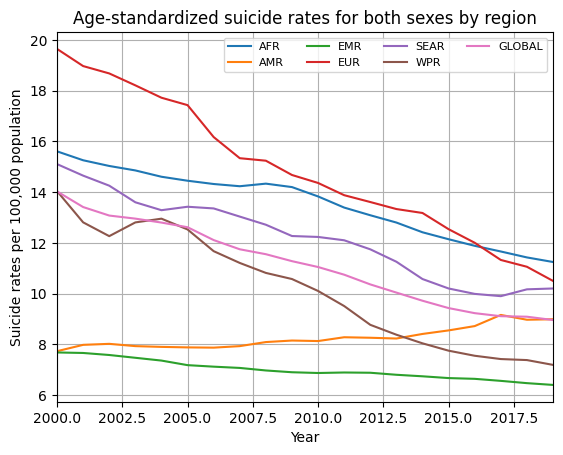
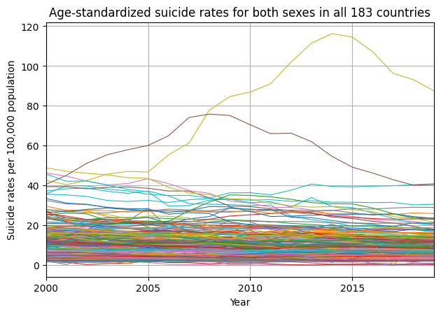
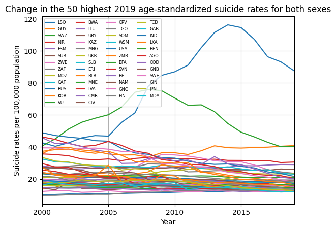
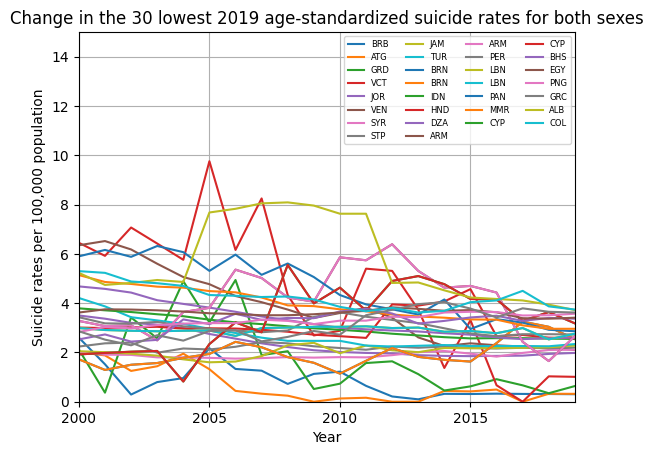

# World Health Organization (WHO) Global Health Observatory (GHO) Data Exploration
There is a saying suggesting that data is the new gold. With the expanding capabilities of machine learning and data driven thinking, it's not far off to say that data is a valuable resource.

## Motivation
Over the past decade or so, there has been growing publicity on crises taking place across the globe. Climate change, ocean acidification, deforestation, natural disasters, and pandemics are a selection that come to mind. In the face of all this, it's not too difficult to reflect on ones own mortality.

The WHO's GHO is one of several resources that I have come across which contain large volumes of data across many different global health related indicators.

---
## Overview
In pursuit of developing my software and data oriented skills, I have made an attempt at grouping the existing WHO GHO indicators using Python to understand what data exists, and how they have changed over time on a global scale.
### Indicator Grouping
The `main.py` script does this indicator grouping for all indicators with a description that contains the key word "death" using fuzzy matching.

### Suicide Rates
The more interesting script in my opinion is `data_suicide.py`. I came across an article taking about South Korea that suggested economic growth had a positive correlation with suicide rates. Curious about this, I found that the WHO GHO database had suicide rate data and built out the simple data visualization script, `data_suicide.py`.

---
## Takeaways
### Indicator Grouping
The `main.py` script was built with the intention to learn SQL, and used PostgreSQL because of the broader capabilities it provided compared to MySQL and SQLite. While novel and interesting to deploy and configure, it became somewhat annoying to manually input my database user credentials and work with the database via Python for such a small dataset.

I opted to use the `thefuzz` Python package to group WHO GHO indicator codes based on how similar the indicator descriptions were to one another. This proved to not be the most precise tool but was interesting to implement. In retrospect, simply comparing the first 3 or so string characters in the indicator code values may have been sufficient to group all of the different indicator codes with one another.

Regardless, the output of this is an array of arrays, where each nested array is a group of death related indicator codes that for the most part falls under a key topic, such as being related to air pollution, occupational risks, or climate change.

This would be useful for seeing the amount of data available for related key topics and further exploration.

### Suicide Rates
The `data_suicide.py` script came about due to a curiosity around that article (which is not referenced as I didn't keep track of it!). It is a straight forward script which visualizes age-standardized rates for both sexes by region, country, and a number of top/bottom countries. 

Having always heard about high suicide rates in Japan, I was surprised to find that they were not among the top 30 rates globally (as of 2019). The highest suicide rates were in a country I had never heard of, Lesotho. Significantly higher than all other countries, they have many challenges facing them, lack of acknowledgement and support for mental health, gender inequality, and decades of poverty, grief, and loss related to the AIDS pandemic.

For more information of Lesotho, you can start looking [here](https://helplesotho.org/lesothos-suicide-crisis).

From the outputs of this script, we can also see that over the past decade, America has been seeing a gradual increase in suicide rates, whereas all other global regions have seen a downward trend.

This is all without any analyses related to economic growth - which is something that would be done in a future revision.

---
## Installation and Running the Project
### `main.py`
I would recommend not running this spaghetti code. It requires access to my local PostgreSQL database. If you can set one up for yourself, you'll need to uncomment `psycopg` code lines to upload data and manipulate data etc. 

Its not good. I believe updating this entire portion to SQLite may be a good option as it wont require a running database server or any of the annoyances that follow for such a small dataset.

### `data_suicide.py`
Ensure you have the following packages in your Python environment:
- requests
- json
- pandas
- matplotlib

All you need to then do is simply run the `data_suicide.py` script and it'll give you a few simple plots.

---
## Future Direction
There are several changes I would make moving forward.

- For `main.py`
    - Replace fuzzy matching scripts with simple string comparisons and accommodate for any outlier conditions
    - Refactor the PostgreSQL portion with SQLite and make the script more streamlined.

- For `data_suicide.py`
    - Analyze how economic growth rates correlate to suicide rates for countries.

---
## References
- [WHO - Suicide Rates](https://www.who.int/data/gho/data/themes/mental-health/suicide-rates)
- [WHO GHO - OData API](https://www.who.int/data/gho/info/gho-odata-api)

## Additional Information
- [CIA - World Factbook](https://www.cia.gov/the-world-factbook/countries/)
- [Global economic uncertainty and suicide: Worldwide evidence](https://www.sciencedirect.com/science/article/pii/S0277953622003471)
- [Worldwide impact of economic cycles on suicide trends over 3 decades: differences according to level of development. A mixed effect model study](https://bmjopen.bmj.com/content/2/3/e000785)